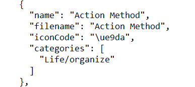

# Copying ReMarkable Templates For Free (windows)

Copying a template onto your ReMarkable tablet sounds scary, but it's actually super easy.  To get started you will need to download some software.

Disclaimer: The steps below are provided as a convenience. I am not responsible for any damage to your ReMarkable by following them. However, this is the method I used when adding my own templates.

## Installing WinScp
Download WinScp from https://winscp.net/eng/download.php

When installing Winscp, choose the "Commander" interface.

## Getting your connection information
1. Navigate to your Settings on your ReMarkable. (Menu -> Settings)
2. Click `About`
3. Scroll to the bottom on `Copyright and licenses`
4. Make note of the IP Address at the bottom as well as the listed password.


## Connecting via WinScp
1. Open WinScp
2. The login dialog will pop up
3. Enter the IP address in the `Host name` field
4. Enter `root` in the `User name` field
5. Enter the password in the `Password` field
6. Click Login


## Copying a Template file

1. Click on the folder name at the top that says `root` and select `/ <root>`
2. Navigate to `/usr/share/remarkable/templates` by clicking the folder names.
3. Drag the new template into the folder.


## Adding Template to the List
Be very careful on these steps as corrupting this file could break your Templates.
1. Backup `templates.json` by dragging it from the right pane (your remarkable) to the left (your computer)
1. Double click `templates.json` on the right pane
2. Scroll to the bottom in line with the last `},` and insert a new line.
3. Copy and paste the block above starting with `{` and ending with `},`
4. Edit the information to match your new template. The iconCode can be any of the other icons that appears in the document (match names to the icon to determine what is what). The filename is the name of your template image WITHOUT `.png`
5. Copy the entire file and paste at http://jsonprettyprint.net/ and click the JSON Pretty Print button.
6. If the page says `Please input valid JSON formatted data` your file is incorrect.
7. Save the file.
8. Restart your ReMarkable.

The code block for the Action Method.png is below exactly as needed.
```
    {
      "name": "Action Method",
      "filename": "Action Method",
      "iconCode": "\ue9da",
      "categories": [
        "Life/organize"
      ]
    },
```

